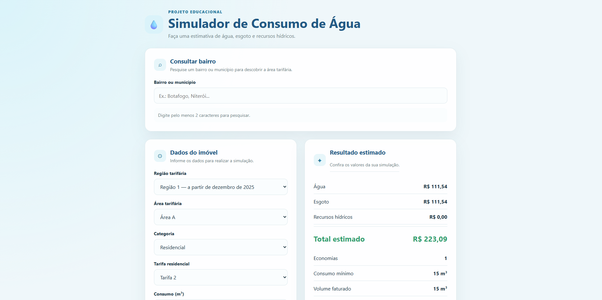

# 💧 Simula Água

Simulador de cálculo de tarifa de água e esgoto desenvolvido com HTML, CSS e JavaScript.

O objetivo deste projeto é permitir que usuários estimem o valor de sua conta de água de forma simples e rápida, utilizando as tarifas vigentes da concessionária, sem possuir qualquer vínculo oficial com ela.

> **Aviso:** Este projeto é independente e foi desenvolvido apenas para fins educacionais e de simulação.

---

## ✨ Funcionalidades

- Cálculo automático da tarifa de água.
- Cálculo da tarifa de esgoto.
- Cálculo da cobrança de Recursos Hídricos.
- Interface simples e responsiva.
- Simulação instantânea diretamente no navegador.
- Exibição detalhada dos valores calculados.

---

## 🛠️ Tecnologias utilizadas

 # Tecnologias
> 


---

## 📷 Demonstração





## 🚀 Como utilizar

1. Clone este repositório

```bash
git clone https://github.com/eduardow890-droid/simula-agua.git
```

2. Abra o arquivo

```
index.html
```

em qualquer navegador moderno.

Não é necessário instalar nenhuma dependência.

---

## 📂 Estrutura do projeto

```
simula-agua/
│
├── index.html
├── style.css
├── app.js
└── README.md
```

---

## ⚠️ Importante

Este simulador fornece apenas uma estimativa baseada nas tarifas cadastradas.

O valor apresentado pode ser diferente da conta oficial devido a fatores como:

- impostos;
- arredondamentos;
- cobranças específicas;
- atualizações tarifárias;
- outras regras da concessionária.

Sempre consulte a fatura oficial para valores definitivos.

---

## 🎯 Objetivo

Este projeto foi criado para:

- estudar JavaScript;
- praticar lógica de programação;
- automatizar cálculos tarifários;
- facilitar a conferência de contas de água.

---

## 📄 Licença

Este projeto está disponível sob a licença MIT.

Você pode utilizar, modificar e compartilhar respeitando os termos da licença.

---

## 👨‍💻 Autor

**Wagner Eduardo**

GitHub:
https://github.com/eduardow890-droid
